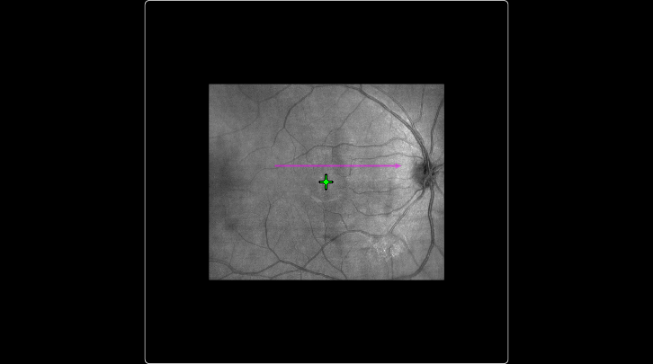
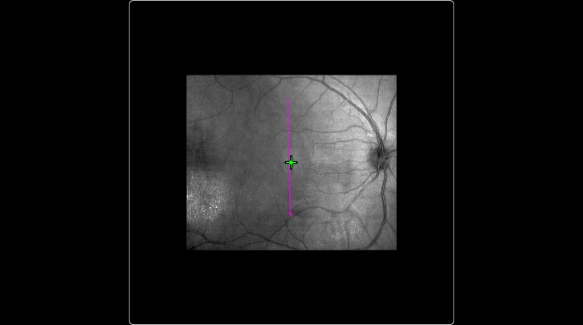
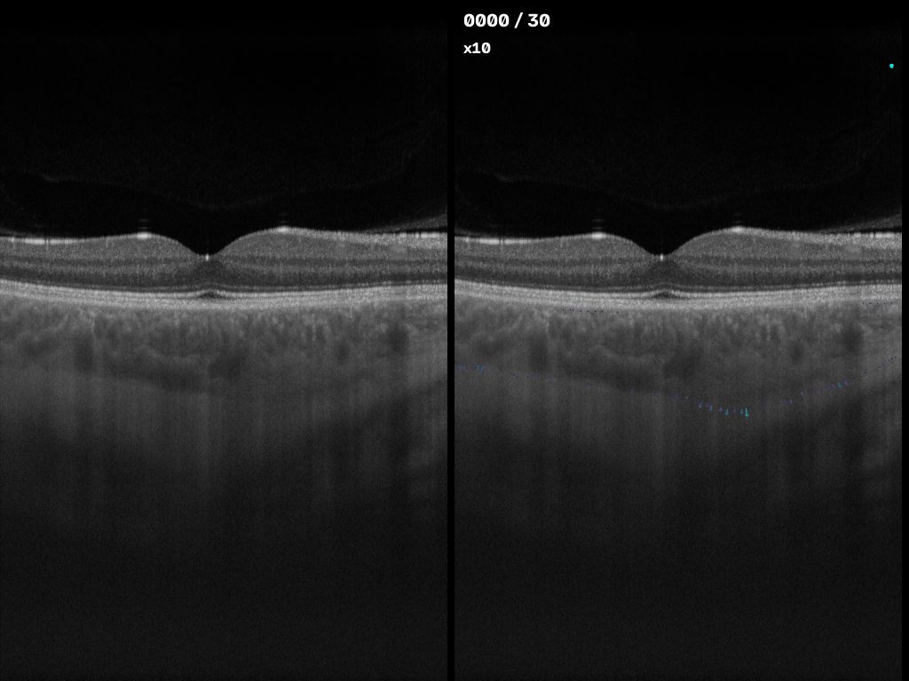
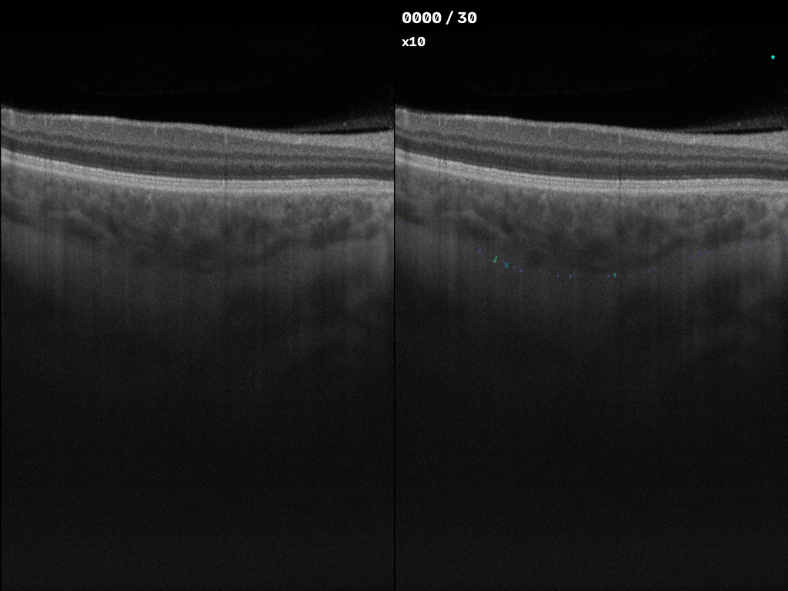
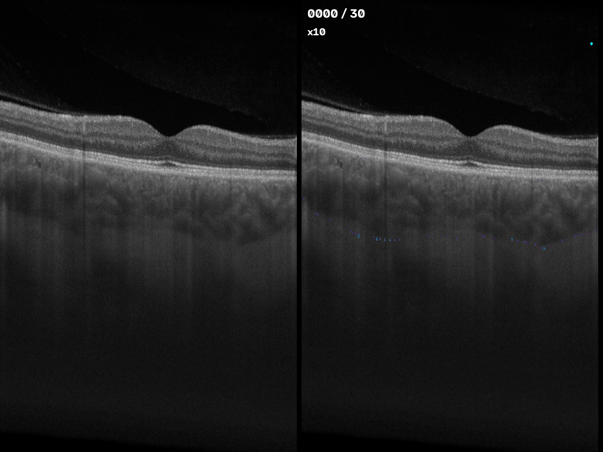

# The anatomical pulsation

The core underlying argument of the ocular rigidity is that the inflation of the eye is driven by blood pulsation along a cardiac cycle, which manifests as a cyclic thickness variation of the choroid. However, there is a gap in the transition from the 2D estimation of thickness and its extension to a 3D volume change: we do not know if the pulsability is uniform across the entire sub-foveal choroid, or at least homogeneous enough to be considered as such. One hypothesis is that in contrary, it is driven by anatomical landmarks, such as the caliber of the choroidal vessels, and the angle of the slice with respect to the choroidal vasculature. In this chapter, we will explore the anatomical pulsation of the choroid, and its potential impact on the ocular rigidity.

## Preliminary results

As a preliminary result, I've inflicted myself with repeated measurements of my right eye during two days.

1. Day 1: 4 measurements on the same location (temporal-nasal axis, through the fovea), 2 hours apart.
2. Day 2: 3 Measurements: 
    + One slightly superior to the fovea, temporal-nasal axis (@fig-temporal-nasal-offset).
    + One cross-section through the fovea, superior-inferior axis (@fig-superior-inferior-offset).
    + One Volume scan of the fovea.

::: {#fig-positional-preliminary layout-ncol=2}

{#fig-temporal-nasal-offset width=400px}

{#fig-superior-inferior-offset width=400px}

The two acquisitions of the same eye, taken with an interval of 10 minutes.
:::

::: {#fig-positional-preliminary-gif layout-ncol=3}

{#fig-temporal-nasal-fovea-gif}

{#fig-temporal-nasal-offset-gif}

{#fig-superior-inferior-gif}

Different B-scans of the same eye drive different measures of the pulsation, which is a strong indication that the pulsation is not uniform across the choroid, and that it is driven by anatomical landmarks.
::: 

We can verify these results quantitatively: not only the thickness of the choroid is different between the three acquisitions, but there is vast differences in the pulsatile thickness, and the relative change of the choroid. The results are summarized in @fig-positional-pulsation-preliminary.


### 3D Vessels Segmentation

#### Methods

The goal of this analysis is to locate the large choroidal vessels in 3D around the fovea, so that the B-scans used for the pulsation measurements can be related to the vessels they cross. We use the volume scan acquired on day 2 (6 × 6 mm angiography protocol, 503 B-scans of 500 A-scans, 1536 samples per A-scan). The device exports two co-registered channels: the structural OCT amplitude and the OCTA flow signal (decorrelation). The voxel size is 12.0 µm between A-scans, 11.9 µm between B-scans, and 1.95 µm axially.

**Choroid segmentation.** Each B-scan is segmented with the choroid segmentation model used throughout this work. The upper boundary of the mask is Bruch's membrane (BM) and the lower one is the choroid–sclera interface (CSI). Both are extracted per A-scan.

**Motion correction between B-scans.** Unlike the repeated B-scans used for the pulsation measurements, every B-scan in a raster volume is acquired at a different position. The eye moves during the ~6 s acquisition, so neighbouring B-scans are displaced axially by amounts that do not correspond to anatomy. The BM jumps by up to ~85 px (~165 µm) over a few B-scans, which is incompatible with a 12 µm spacing between them. We estimate this motion from the BM and remove it:

1. For each B-scan $t$, a line $\text{BM}_t(x) = a_t + b_t\,(x - x_c)$ is fitted by least squares, where $x_c$ is the central A-scan.
2. Along the slow (inferior–superior) axis, the anatomical component of $a_t$ and $b_t$ is modelled as a second-order polynomial, fitted robustly by iteratively reweighted least squares with Tukey's biweight. This accounts for the curvature of the eye. The residuals $\Delta a_t$ and $\Delta b_t$ are taken as motion.
3. Every A-scan is shifted axially by $\Delta a_t + \Delta b_t\,(x - x_c)$, using linear interpolation for the amplitude and flow volumes and nearest-neighbour interpolation for the choroid masks. Amplitude and flow receive the same shift, since they come from the same acquisition.

Before fitting, we flag corrupted B-scans. The mean amplitude in a slab below the BM is dominated by the shadows of the retinal vessels, which are continuous across a valid raster. A B-scan whose shadow profile correlates with neither neighbour, with the correlation more than 6 median absolute deviations below the median, is excluded from the fit and from the analysis. In this volume, this concerns only the last three B-scans. Lateral displacements between neighbouring B-scans, measured by cross-correlating the shadow profiles, were 0 ± 1 px, except for a single ~30 px jump, and were not corrected. The median axial jump of the BM between neighbouring B-scans went from 2.0 px before correction to 0.45 px after. Slow drift over the acquisition cannot be separated from the curvature of the eye with a single raster scan, so it remains in the anatomical component.

**Vessel segmentation.** Single B-scans are too noisy to segment the choroidal vessels reliably, for instance with a per-B-scan Niblack threshold. We therefore segment them in 3D, on the motion-corrected volume, combining both channels. In both, the lumen of the large vessels is dark.

1. *Flattening and resampling.* Both volumes are resampled so that the BM is a flat plane, keeping 330 samples (~640 µm) below it. The BM is first smoothed with a 3 × 9 median filter followed by a Gaussian filter (σ = 1 B-scan, 3 A-scans). The axial dimension is then averaged in bins of 6 samples, which gives nearly isotropic voxels (~12 µm) and reduces speckle. Voxels deeper than the smoothed choroidal thickness (CSI − BM, Gaussian σ = 2) are excluded.
2. *Normalisation and fusion.* Each channel is divided by its median over the A-scans of each B-scan at each depth. This removes both depth attenuation and B-scan-to-B-scan intensity changes. Each channel is then divided by a broad lateral background (Gaussian, σ = 30 voxels) and log-transformed, $\log(I + 0.05)$, which turns the multiplicative speckle into additive noise. The two channels are standardised inside the choroid and averaged with equal weights.
3. *Removal of retinal shadows.* The retinal vessels cast thin shadows that are identical at every depth. We compute the lateral high-frequency detail of the fused volume (the volume minus its Gaussian-smoothed version, σ = 4 voxels), take its median over depth inside the choroid, and subtract it from every layer.
4. *Tube enhancement.* For each scale σ ∈ {3, 4.5, 6, 8} voxels (~35–100 µm; these scales respond best to vessels ~100–270 µm in diameter), we compute the eigenvalues of the scale-normalised Hessian ($\sigma^2 H$), sorted by magnitude $|\lambda_1| \le |\lambda_2| \le |\lambda_3|$. A dark tube has $\lambda_2, \lambda_3 > 0$ and $\lambda_1 \approx 0$. The response is
   $$R_\sigma = \sqrt{\lambda_2 \lambda_3}\,\exp\!\left(-\frac{\lambda_1^2}{2\,(0.5\,\lambda_2)^2}\right) \quad \text{if } \lambda_2, \lambda_3 > 0, \text{ else } 0,$$
   and the vesselness $R$ is its maximum over scales. The response is set to zero within two voxels of the BM and CSI, where the boundaries would otherwise appear as dark tubes. Because the thick subfoveal choroid gives a weaker response, $R$ is normalised by its local level: $R / (G_{40} * R + 0.5\,\overline{G_{40} * R})$, where $G_{40}$ is a lateral Gaussian with σ = 40 voxels.
5. *Thresholding.* A voxel is labelled as vessel if (i) it belongs to a hysteresis segmentation of the normalised response, with the high and low thresholds set to its 95th and 85th percentiles inside the choroid, and (ii) it passes a 3D Niblack test on the fused signal smoothed with a Gaussian (σ = 2): $F < m + k\,s$, with $m$ and $s$ the local mean and standard deviation over a 61 × 21 × 61 voxel window and $k = -0.2$. Connected components smaller than 20 000 voxels (~0.03 mm³) are discarded. Together with the scales of the Hessian, this restricts the segmentation to the main choroidal vessels.

The segmentation was checked visually on B-scans and en-face slabs, but not against manual annotations. It likely under-segments the thick subfoveal choroid, where the signal is weakest.

**Fovea and visualisation.** The fovea is located at the minimum of the retinal thickness map (ILM to BM). The map is smoothed with a Gaussian (σ = 8 px), and a quadratic penalty on the distance to the centre of the scan is added before taking the minimum. The vessel surface is extracted by marching cubes from the vessel mask (smoothed with a Gaussian, σ = 1 voxel), and each vertex is mapped back to its depth below the BM. @fig-choroid-vessels-3d shows the vessels together with the BM and CSI surfaces, and two amplitude sections through the fovea along the temporal–nasal and inferior–superior axes.

::: {#fig-choroid-vessels-3d}

<iframe src="positional_pulsation/choroid_vessels_3d.html" width="100%" height="700" style="border: none;" loading="lazy" title="3D view of the choroidal vessels"></iframe>

Main choroidal vessels between the BM and the CSI after motion correction, with temporal–nasal and inferior–superior slices through the fovea. Vessel colour gives depth below the BM. The figure is interactive: drag to rotate, scroll to zoom, and click the legend to hide a surface.

:::
