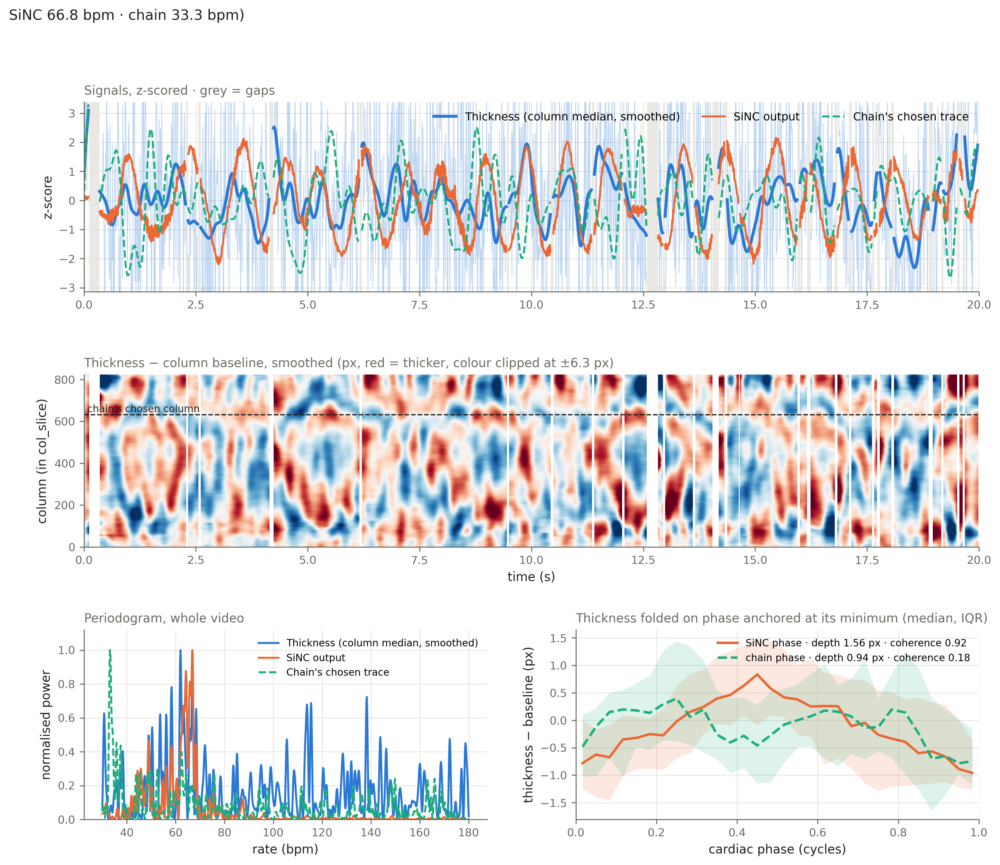

# Learned pulse extraction {#sec-sinc-pulsation}

Our current pulse extraction relies on classical signal processing: a Lomb-Scargle periodogram computed on traces extracted from the video, followed by the selection of the best candidate trace. This approach has practical limitations. Its parameters were tuned on a limited number of videos and may not generalize to the rest of the cohort. The data are also noisy, which is a challenge for classical methods. The usual ways of reducing many traces to a single one (average pooling, SVD decomposition, etc.) can work, but they do not exploit the temporal consistency we expect to find across the noisy traces. Finally, the chain depends on a prior: the measured heart rate is used both to narrow the frequency search band (to ±30 % of the measured value) and to rank the quality of each trace.

It turns out that there is a large literature on learning-based methods for remote photoplethysmography (rPPG), which estimates the heart rate from a video without contact. Our problem is the choroidal analogue of rPPG: instead of recovering the blood volume pulse from subtle color changes of the skin, we recover the cardiac pulsation of the choroid from subtle displacements of its boundaries. The advantage of learning-based methods is that they can learn to extract the pulse from the video without manual tuning of parameters and, even better, without a per-video prior on the expected heart rate.

There are two main approaches to learning rPPG from videos. The first is supervised regression, which requires the ground truth signal (contact photoplethysmography or ECG) recorded simultaneously with the video. The second is unsupervised: it looks for patterns in the video that are consistent with a periodic, physiologically plausible signal, without any ground truth. We only have a heart rate measured around the time of the acquisition, not a synchronized waveform, so we focus on the latter.

## Quick overview of unsupervised learning for photoplethysmography

Early deep-learning rPPG methods, such as DeepPhys [@chen2018deepphys] and PhysNet [@yu2019physnet], are supervised: a network is trained to regress the contact PPG waveform from the video. Because synchronized ground-truth waveforms are expensive to collect, later work turned to unsupervised learning.

Most of the unsupervised literature relies on contrastive learning [@gideon2021way; @sun2022contrastphys]. The idea is to build pairs of signals that should (positives) or should not (negatives) share the same pulse. Different time windows or spatial regions of the same video should share the same frequency, even if their phases differ, and their power spectra are pulled together. Negatives are obtained from other videos, or by resampling a video in time, which artificially shifts its heart rate; their power spectra are pushed apart. The network therefore learns a representation in which the dominant frequency is what distinguishes videos, while remaining invariant to phase, noise and appearance.

Contrastive approaches have two drawbacks for our use case. First, they need carefully designed negatives, and in a small cohort two different videos can easily have the same heart rate, which makes "different video" a poor proxy for "different rate". Second, the loss is computed between pairs of samples, which constrains the batch composition and increases the computational cost.

## The SiNC approach

SiNC ("Signal Non-Contrastive") [@10205146] removes the need for negatives. Instead of comparing samples, it constrains each predicted waveform directly in the frequency domain, using three weak priors about what a pulse looks like:

- **Bandwidth**: the pulse lives in a known frequency band $[f_\text{lo}, f_\text{hi}]$ (here 30–180 bpm). With $P(f)$ the normalized power spectrum of the predicted waveform, the bandwidth loss is the fraction of power outside that band:
  $$
  \mathcal{L}_b = \frac{\sum_{f \notin [f_\text{lo}, f_\text{hi}]} P(f)}{\sum_{f} P(f)}.
  $$
- **Sparsity**: within the band, the power should be concentrated around a single peak $f^\ast$. With $\tilde P$ the in-band spectrum normalized to unit sum, the sparsity loss is the in-band power farther than $\Delta$ from the peak:
  $$
  \mathcal{L}_s = \sum_{f \in [f_\text{lo}, f_\text{hi}],\ |f - f^\ast| > \Delta} \tilde P(f).
  $$
- **Variance**: the first two losses can be minimized trivially by always predicting the same sinusoid. To prevent this collapse, the average in-band spectrum over a batch, $\bar P$, must match a prior distribution of rates $Q$. The distance is the squared 1-D Wasserstein distance, computed from the cumulative distributions:
  $$
  \mathcal{L}_v = \frac{1}{N_F} \sum_{k=1}^{N_F} \left( \sum_{j \le k} \bar P(f_j) - \sum_{j \le k} Q(f_j) \right)^2.
  $$

The total loss is $\mathcal{L} = \mathcal{L}_b + \mathcal{L}_s + \mathcal{L}_v$. None of these terms uses the heart rate of an individual video: the network is only asked to output, for each clip, a waveform with a single clear in-band peak, while the rates across clips remain spread out.

The variance loss requires the batch to contain a range of rates. SiNC obtains it through speed augmentation: each clip is resampled at a random speed $s$ before being fed to the network, while keeping the original frame spacing, so that the pulse of the augmented clip appears at $s$ times the true rate.

### Adaptation to choroidal OCT videos

The original method was designed for RGB videos of faces. We adapted it as follows.

**Input.** The network does not see the images. Its input is the map of the registered Bruch's membrane (BM) and choroid–sclera interface (CSI) positions for each A-scan and each frame. Registered positions are integer pixels, and a single A-scan moves by roughly ±0.7 px, mostly due to quantization. We therefore average neighboring A-scans down to 256 columns, which recovers sub-pixel motion. Each column's temporal median is removed, and the map is interpolated on the uniform time grid used by the rest of the pipeline. The network receives four channels: BM, CSI, choroidal thickness (CSI − BM) and a frame-validity mask. Each clip is normalized by removing the per-column mean and dividing by a single global scale.

**Architecture.** The network is fully convolutional in time, so the same weights can process a 10 s training clip or a whole video. It consists of:

1. four 2-D residual convolution blocks over (time, column), with temporal kernels of increasing dilation (1, 2, 4, 8), each halving the number of columns;
2. a learned attention pooling over columns, a learned counterpart of the "which A-scans carry the pulse" selection of the classical chain;
3. four dilated 1-D residual blocks and a final projection that outputs one sample per frame.

The receptive field is about 1.5 s. This is enough to shape a pulse, but far too short for the network to invent a periodicity that is not present in the input.

**Irregular sampling.** Our videos contain gaps (dropped or rejected frames). The original method computes an FFT on uniformly sampled clips. Instead, we compute the power spectrum as a direct discrete Fourier transform evaluated at each sample's own timestamp, restricted to valid samples. Gaps are simply absent from the sum, and no interpolation of the network output is required. The mean over valid samples is removed beforehand, since the gap pattern would otherwise leak part of the DC component into the cardiac band.

**Prior on rates.** The original paper uses a uniform prior over the band. On our cohort (heart rates between 52 and 90 bpm for the 5th–95th percentiles), a uniform 30–180 bpm prior requires half of the power to lie above 105 bpm. The network satisfied it by locking clips onto the second harmonic of the pulse: across epochs, the variance loss and the harmonic rate were correlated at −0.84. We therefore replaced the uniform prior by the distribution of measured heart rates in the training patients, convolved with the speed augmentation, smoothed with a Gaussian kernel (0.05 Hz), and mixed with a small uniform floor (2 % of the mass) so that no in-band rate is excluded. Only this aggregate distribution is used, never the rate of an individual clip.

**Training.** Videos are split at the patient level (85 % training, 15 % validation), so no eye of a validation patient is seen during training. Each epoch draws 4096 random clips of 870 samples (about 10 s at 87 Hz); windows with more than 30 % of missing frames are redrawn. Augmentations are the speed resampling ($s \in [0.7, 1.4]$) and a random left–right flip of the columns. The model is trained for 60 epochs with AdamW (learning rate $10^{-3}$, weight decay $10^{-2}$, cosine schedule) and a batch size of 16. Loss weights are all set to 1, with $\Delta = 0.1$ Hz (6 bpm).

:::{.callout-note}
The training loss itself does not use any individual heart rate, but checkpoint selection does. On the validation set, the loss kept decreasing while the estimated rate got worse (again because of harmonic locking), so the retained checkpoint is the one with the lowest mean absolute error between the estimated rate and the measured heart rate of the validation patients. The method is therefore free of any per-video prior at inference, but not entirely label-free.
:::

**Inference.** At inference time, the trained network replaces the trace extraction and selection stages; the rest of the pipeline is unchanged, and segmentation and registration are reused from the classical run. The network is run over the whole video, which yields a single waveform. Its rate is estimated with the Lomb-Scargle periodogram over the full 30–180 bpm band, without any expected heart rate, and its phase is obtained by IQ demodulation. Because the sign and lag of the learned waveform are arbitrary, the phase has no physical meaning on its own. It is therefore re-anchored on the minimum of choroidal thickness, separately for each folded cycle, so that every cycle starts deflated and inflates first, as with the classical approach.

## Results

### Heart rate estimation

SiNC matches the heart rate measured by the contact sensor less closely than the traditional approach, as illustrated in @fig-sinc-vs-traditional-hr. This is expected: the traditional approach restricts its search to ±30 % of the measured heart rate and uses it to rank the traces, so its agreement with the measured value is partly built in. SiNC does not receive this information.



In the end, this is not necessarily what matters most. The demodulation works on a clean signal, which the traditional approach did not always provide. In some cases where the measured heart rate is missing, SiNC recovers a signal that the traditional approach lost. @fig-sinc-vs-traditional-plot-example illustrates this.

{#fig-sinc-vs-traditional-plot-example fig-align="center"}

### Stronger pulsability

@fig-sinc-vs-traditional-deltact compares the pulsability measured with the two methods. Overall, the two measurements are strongly correlated, but SiNC yields a slightly larger measured displacement.



### Better replicability?

In the three-cycle comparison, SiNC tends to produce slightly more replicable results than the traditional approach. @fig-sinc-vs-traditional-deltact-cycles compares the three cycles for both methods.


